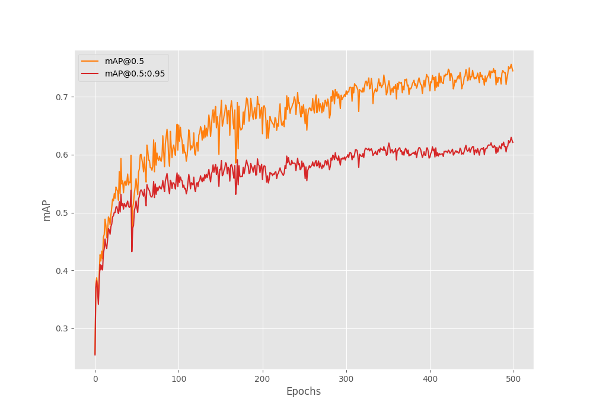

# Auto-WCEBleedGen Challenge

## Automatic Detection and Classification of Bleeding and Non-Bleeding frames in Wireless Capsule Endoscopy
 
## Meet The Team (KU Researchers)
- Adarsh Ghimire
- Basit Alawode
- Divya Velayudhan 
- Shibani Hamza

## The Data
We split the given train data into training and validation splits using the ratio 80:20. We provide the link to these splits below

- Train and Validation Split [link]()

The respective folders in the link also include the xml generated from the given dataset mask of each image.

## Code Usage

## Results: Classification (Validation Set)

<table>
  <tr>
    <th></th>
    <th>Accuracy</th>
    <th>Recall</th>
    <th>F1-Score</th>
  </tr>

  <tr>
    <th></th>
    <th>98.28</th>
    <th>96.79</th>
    <th>98.37</th>
  </tr>
</table>

## Results: Detection (Validation Set)

<table>
  <tr>
    <th></th>
    <th>Average Precision (AP @ 0.5)</th>
    <th>Mean-Average Precision (mAP)</th>
    <th>Recall (@ 0.5:0.95)</th>
  </tr>

  <tr>
    <th></th>
    <th>0.7447</th>
    <th>0.7328</th>
    <th>0.7706</th>
  </tr>
</table>

## Results: Sample Images (Validation Set)
 - 10 best images showing classisifation and detection (bbox with conf. level)

 ## Results: Interpretability Plot (Validation Set)
 - 10 best images 

## Results: Sample Images (Test Set 1)
 - 5 best images

 ## Results: Interpretability Plot (Test Set 1)
 - 5 best images 

## Results: Sample Images (Test Set 2)
 - 5 best images 

## Results: Interpretability Plot (Test Set 2)
 - 5 best images 

# Others:
 - Code
 - Excel sheet

# Acknowledgement
 - This work acknowledges the use of the vision transformer library [here](https://github.com/sovit-123/vision_transformers).

