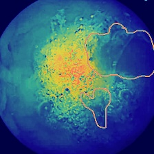
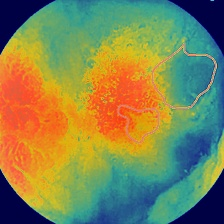
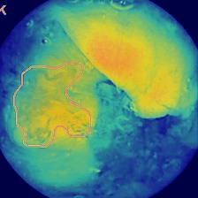
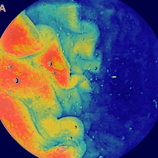
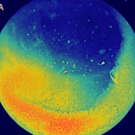
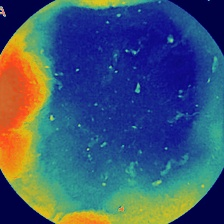

# Auto-WCEBleedGen Challenge

## Automatic Detection and Classification of Bleeding and Non-Bleeding frames in Wireless Capsule Endoscopy
 
## Meet The Team (KU Researchers)
- Adarsh Ghimire
- Basit Alawode
- Divya Velayudhan 
- Shibani Hamza

## The Data
We split the given training data into new training and validation splits using the ratio 80:20. We provide the link to these splits below:

- Train and Validation Split [link](https://kuacae-my.sharepoint.com/:u:/g/personal/100060517_ku_ac_ae/EYn_FLfCVmRFikeoHjrjjs0BFXD8oX48_MlAvmLN_PY9eA?e=TXRvZO)

The respective folders in the link also include the xml generated from the given dataset mask of each image.


## Results: Classification (Validation Set)

<table>
  <tr>
    <th></th>
    <th>Accuracy (%)</th>
    <th>Recall (%)</th>
    <th>F1-Score (%)</th>
  </tr>

  <tr>
    <th></th>
    <th>98.28</th>
    <th>96.79</th>
    <th>98.37</th>
  </tr>
</table>

## Results: Detection (Validation Set)

<table>
  <tr>
    <th></th>
    <th>Average Precision (AP @ 0.5)</th>
    <th>Mean-Average Precision (mAP)</th>
    <th>Recall (@ 0.5:0.95)</th>
  </tr>

  <tr>
    <th></th>
    <th>0.7447</th>
    <th>0.7328</th>
    <th>0.7706</th>
  </tr>
</table>

Below is a plot showing the mean average precision (mAP) of the model on the validation set during training.


## Results: Sample Images (Validation Set)
<table>
  <tr>
    <td> </td>
    <td> </td>
    <td> </td>
    <td> </td>
  </tr>

  <tr>
    <td> </td>
    <td> </td>
    <td> </td>
    <td> </td>
  </tr>

  <tr>
    <td> </td>
    <td> </td>
  </tr>
</table>

 ## Results: Interpretability Plot (Validation Set)
 NOTE: The below interpretability images are independent of the above predictions.
<table>
  <tr>
    <td> </td>
    <td> </td>
    <td> </td>
    <td> </td>
  </tr>

  <tr>
    <td> </td>
    <td> </td>
    <td> </td>
    <td> </td>
  </tr>

  <tr>
    <td> </td>
    <td> </td>
  </tr>
</table>

## Results: Sample Images (Test Set 1)
<table>
  <tr>
    <td> </td>
    <td> </td>
    <td> </td>
  </tr>

  <tr>
    <td> </td>
    <td> </td>
  </tr>
</table>

 ## Results: Interpretability Plot (Test Set 1)
 NOTE: The below interpretability images are independent of the above predictions.
<table>
  <tr>
    <td> </td>
    <td> </td>
    <td> </td>
  </tr>

  <tr>
    <td> </td>
    <td> </td>
  </tr>
</table>

## Results: Sample Images (Test Set 2)
<table>
  <tr>
    <td> </td>
    <td> </td>
    <td> </td>
  </tr>

  <tr>
    <td> </td>
    <td> </td>
  </tr>
</table>

## Results: Interpretability Plot (Test Set 2)
NOTE: The below interpretability images are independent of the above predictions.
<table>
  <tr>
    <td> </td>
    <td> </td>
    <td> </td>
  </tr>

  <tr>
    <td> </td>
    <td> </td>
  </tr>
</table>

## Deliverables:
 1. Trained Model Weights: 
 
 Our trained model weights can be downloaded from [here](https://kuacae-my.sharepoint.com/:u:/g/personal/100060517_ku_ac_ae/EQw6Kf1bgVFKmUnrhKaDtXEB9OOEH5925HPfM2tCgTPKiw?e=loddy)
 
 2. Test Dataset Results Excel Sheets:

 The excel sheets for the test sets can be found inside the [results/excel](results/excel) folder.

## Experiment Setup

1. Download this repository and open in a python editor (preferably VS code).

1. Create the python environment

```bash
conda create -y --name bleedgen python==3.7.16
conda activate bleedgen  
```

2. Install pytorch and torchvision

```bash
pip install torch==1.10.0+cu111 torchvision==0.11.0+cu111 torchaudio==0.10.0 -f https://download.pytorch.org/whl/torch_stable.html
```

3. Install other packages

```bash
pip install -r requirements.txt
```

4. Download the train and validation data using this [link](https://kuacae-my.sharepoint.com/:u:/g/personal/100060517_ku_ac_ae/EYn_FLfCVmRFikeoHjrjjs0BFXD8oX48_MlAvmLN_PY9eA?e=TXRvZO) 

5. Unzip and put the train and validation data into their respective folders (train/Train) and (train/Val).

6. Also, put the test data into their respective folders (test/Test_Dataset_1) and (test/Test_Dataset_2).

## Training

To train, open and run [train.py](./train.py) in the created environment. 

```bash
python train.py
```

NOTE: 

1. Training results will be available inside the [runs](./runs/) folder.

## Testing

To test:

1. Download our already trained model weights [here](https://kuacae-my.sharepoint.com/:u:/g/personal/100060517_ku_ac_ae/EQw6Kf1bgVFKmUnrhKaDtXEB9OOEH5925HPfM2tCgTPKiw?e=loddyL) and put inside the [trained_weights](./trained_weights) folder.

2. Open and run [test.py](./test.py) in the created environment. 

```bash
python test.py
```

NOTE: 

1. Comment any two of Lines 17, 18, and 19 in [test.py](./test.py) to select one of validation set, test set 1, and test set 2 for testing.

2. Testing results will be available inside the [results](./results/) folder.
 

# Acknowledgement
 - This work is based on this [vision transformer](https://github.com/sovit-123/vision_transformers) library.


